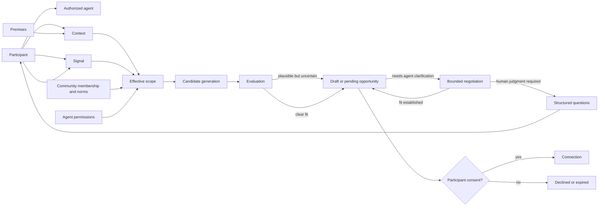
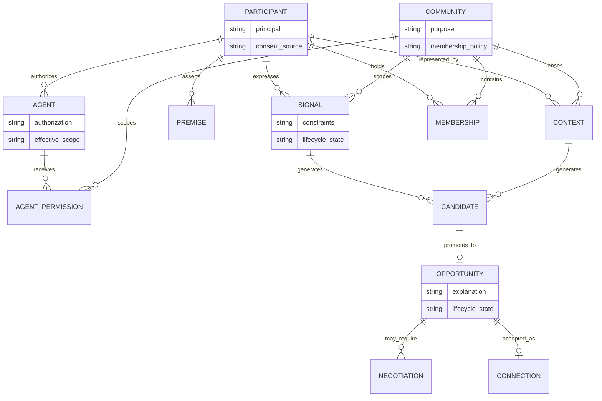
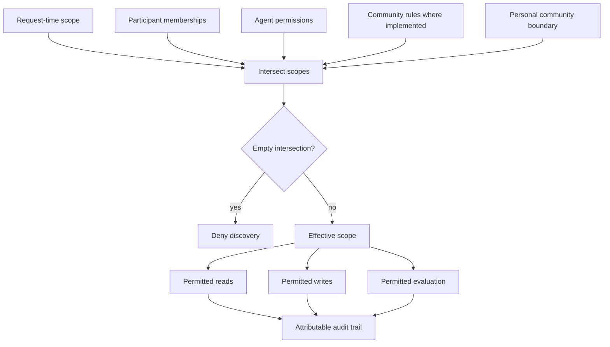
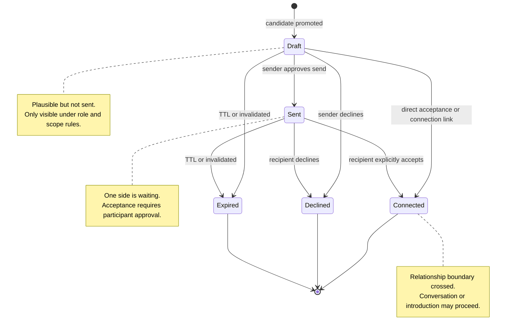
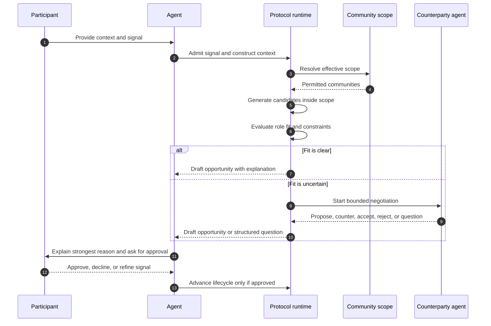
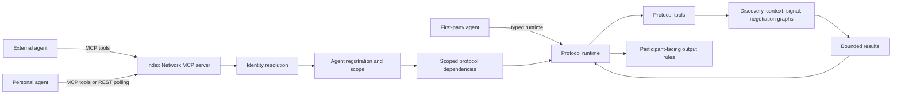

# Index Network Protocol

## Status

This document describes the public protocol model for Index Network: the entities, state transitions, agent obligations, privacy boundaries, and discovery semantics that define interoperable participation in the network.

The canonical reference implementation is published as `@indexnetwork/protocol`. Implementation details, package installation, exported APIs, adapter contracts, graph factories, and release mechanics are documented separately in [IMPLEMENTATION.md](./IMPLEMENTATION.md). Public API stability is defined in [STABILITY.md](./STABILITY.md).

Normative terms such as **MUST**, **MUST NOT**, **SHOULD**, and **MAY** are used in their ordinary protocol-documentation sense.

## Abstract

Index Network is a private, intent-driven discovery protocol for agent-mediated opportunity discovery.

Participants express **signals**: structured statements of what they seek, offer, are open to, or can credibly support. Agents interpret those signals against participant **context**, constrain discovery to bounded **communities**, evaluate candidate overlaps, negotiate fit when appropriate, and surface **opportunities** only through consent-gated state transitions.

The protocol is designed for high-signal human and agent coordination. It is not a public people database, keyword search engine, advertising channel, or automated introduction machine. Its purpose is to discover meaningful overlap while preserving context, scope, and human approval.

## Protocol overview

The graph is intentionally consent-centered: agents can construct context, discover candidates, evaluate fit, and negotiate constraints, but relationship-forming transitions require participant approval before a connection is opened.

## Design goals

1. **Intent as the primary primitive** — discovery begins from a participant's current signal, not from static identity alone.
2. **Bounded visibility** — communities define the scope in which signals and context may be evaluated.
3. **Semantic discovery** — matching is based on role fit, constraints, complementarity, and contextual relevance rather than exact keyword overlap.
4. **Explainable surfacing** — every surfaced opportunity SHOULD include a legible reason: why these participants, why now, and what the next action might be.
5. **Consent at relationship boundaries** — agents MAY discover and negotiate, but MUST NOT create or accept a relationship without explicit participant approval.
6. **Agent interoperability** — first-party agents, personal agents, community agents, and external MCP clients SHOULD be able to participate under the same behavioral contract.

## Non-goals

The protocol does not attempt to be:

- a global directory of people,
- a public search index,
- a social feed ranking protocol,
- a marketplace listing format,
- a replacement for human judgment,
- or a mechanism for bypassing consent, membership, or community boundaries.

## Terminology

| Term | Definition |
|---|---|
| **Participant** | A human principal represented in the network. A participant may act directly or through one or more agents. |
| **Agent** | A software actor authorized to act for a participant or community within a declared scope. |
| **Signal** | A participant's actionable expression of intent: what they seek, offer, need, are building, are exploring, or can support. |
| **Premise** | An atomic contextual claim about a participant, used to ground what signals are plausible or relevant. |
| **Context** | A synthesized representation of premises, history, constraints, and community-specific relevance. |
| **Community** | A bounded discovery scope with membership, purpose, norms, and relevance criteria. |
| **Membership** | The relationship between a participant and a community. Agents receive community authority through separate scoped permissions. |
| **Candidate** | A possible counterpart or opportunity component identified during discovery but not yet surfaced. |
| **Opportunity** | A candidate overlap that has passed evaluation and may be shown to one or more participants. |
| **Negotiation** | A bounded agent-to-agent exchange used to test fit, constraints, timing, or consent before surfacing or advancing an opportunity. |
| **Connection** | A participant-approved communication channel or introduction resulting from an accepted opportunity. |

Some implementation APIs may expose historical names such as `intent`, `index`, `network`, `latent`, `pending`, `accepted`, `rejected`, `negotiating`, or `stalled`. Public-facing agents SHOULD translate stable participant states into protocol terms such as **signal**, **community**, **draft**, **sent**, **connected**, and **declined**, while treating negotiating or stalled states as internal process state unless the participant needs to act on them.

## Object relationship model

This model is conceptual rather than storage-prescriptive. Implementations MAY choose different table names or internal representations, but MUST preserve the same attribution, scope, and consent semantics.

## System model

### Principals

The protocol distinguishes human principals from software actors.

- A **participant** is the source of consent and personal context.
- An **agent** is an authorized actor. Every agent action MUST be attributable to a participant, a community, or both.
- A **community** may define local discovery norms, but it does not override participant consent.

### Scope

All discovery is scope-bound. A protocol operation MUST resolve an effective scope before cross-participant discovery, candidate generation, or opportunity evaluation. Implementations MAY read the requesting participant's own signals or context while preparing that operation.

A scope may include:

- a participant's personal community,
- one or more shared communities,
- an agent's assigned community scope,
- or a narrower request-time scope selected by the participant.

Agents MUST NOT use access to one community to infer, reveal, or act on information from another community unless the effective scope explicitly permits it.

Effective scope is the intersection of all applicable authority boundaries:

A broader credential MUST NOT expand a narrower request. A narrower agent permission MUST clamp a broader participant membership. Community-specific policy checks MAY further reduce effective scope where an implementation defines them.

### Public and private surfaces

The protocol separates internal state from participant-facing language.

Internal records MAY contain IDs, embeddings, scores, graph state, and tool names. Participant-facing responses MUST NOT expose these implementation details unless an identifier is directly actionable by the participant, such as a conversation identifier needed to open an accepted connection.

## Core objects

### Signal

A signal is an actionable statement of direction. It may represent a need, offer, collaboration interest, hiring intent, funding goal, research direction, introduction request, or other future-oriented constraint.

A signal SHOULD contain enough specificity to support discovery. Underspecified signals SHOULD enter clarification before they are persisted or used for broad discovery.

Signals have the following conceptual lifecycle:

| State | Meaning |
|---|---|
| **Proposed** | A participant or agent supplied raw intent-like input. |
| **Clarifying** | The protocol requires additional constraints before discovery. |
| **Active** | The signal is valid, scoped, and eligible for discovery. |
| **Updated** | The participant refined or replaced constraints. |
| **Archived / expired** | The signal should no longer produce new opportunities. |

A signal MUST NOT be treated as active if it is outside the participant's authority, obviously insincere, unsafe to act on, or too vague to evaluate.

### Premise and context

A premise is a small claim about a participant: background, role, current work, capability, location, affiliation, constraint, or declared preference. Premises ground discovery by determining whether a signal is plausible and which communities or counterparts are relevant.

Context is derived from premises. Context MAY be global to a participant or specific to a community. Community-specific context SHOULD emphasize facts relevant to that community's purpose and suppress irrelevant detail.

Premise and context updates SHOULD cause downstream discovery representations to refresh. Stale context SHOULD NOT be used when fresher participant-approved context exists.

### Community

A community is a bounded discovery environment. It defines who can participate, what kinds of signals are relevant, and which discovery operations are legitimate.

A community SHOULD have:

- a purpose or prompt,
- membership rules,
- agent permissions,
- relevance expectations,
- and privacy expectations.

The participant's personal community represents trusted contacts and direct relationships. It is not equivalent to a public audience.

### Opportunity

An opportunity is an evaluated overlap between participants. It is not merely a candidate returned by retrieval. It must be specific enough to explain and safe enough to surface.

An opportunity SHOULD include:

- participating roles,
- the relevant signal or context on each side,
- a concise explanation of fit,
- a recommended next action,
- lifecycle state,
- and visibility rules for each participant.

Opportunity states are participant-facing as follows:

| State | Participant-facing term | Meaning |
|---|---|---|
| **Draft** | Draft | The protocol found a plausible opportunity, but it has not been sent to the other side. |
| **Sent** | Sent | One side has sent or received the opportunity and a response is pending. |
| **Connected** | Connected | Required participants accepted and a conversation or introduction may proceed. |
| **Declined** | Declined | A participant rejected the opportunity. |
| **Expired** | Expired | The opportunity is no longer actionable. |

A conforming agent MUST NOT present a received opportunity as **Connected** without explicit approval from the receiving participant. The reference implementation enforces actor authorization and valid source statuses for acceptance, while current-approval capture is handled by the agent or user-interface flow invoking the transition.

### Opportunity lifecycle

## Discovery procedure

A conforming discovery flow has seven phases.

### 1. Context construction

The protocol collects participant-provided or participant-authorized material and turns it into premises and context. Context construction MUST preserve provenance and SHOULD prefer participant-approved information over inferred information.

### 2. Signal admission

The protocol evaluates a proposed signal for specificity, sincerity, authority, and safety. If the signal is too broad, ambiguous, or missing critical constraints, the agent SHOULD ask focused clarification questions before running discovery.

### 3. Scope resolution

The protocol determines the effective communities in which the signal can operate. Scope resolution MUST intersect participant membership, agent permissions, and request-time constraints. If the intersection is empty, discovery MUST NOT proceed.

### 4. Candidate generation

The protocol generates candidates by comparing signals and context inside the effective scope. Candidate generation MAY use multiple strategies, including signal-to-signal, context-to-signal, premise-to-premise, semantic retrieval, and directed target construction.

Candidate generation is not surfacing. Candidate data MUST remain internal until evaluation and visibility checks pass.

### 5. Evaluation

The protocol evaluates candidates for role fit, constraint satisfaction, credibility, reciprocity, timing, and explainability. A candidate SHOULD be rejected or retained as internal evidence if the protocol cannot produce a clear reason for surfacing it.

### 6. Negotiation

When fit is plausible but uncertain, agents MAY negotiate. Negotiation MUST be bounded. It SHOULD clarify constraints, test mutual relevance, and decide among a small set of actions: propose, counter, accept, reject, or ask a question. Implementations MAY persist an opportunity before negotiation completes and then update its public state from the negotiation outcome.

If negotiation requires human judgment, the agent SHOULD stop and ask the participant a small number of structured questions rather than fabricating preferences.

### 7. Surfacing and acceptance

The protocol surfaces the opportunity according to role and lifecycle visibility. Participant-facing presentation SHOULD include the strongest reason for relevance and a clear next action. Sending, accepting, or connecting MUST require participant consent at the relevant boundary.

## Agent requirements

A conforming agent MUST:

- act only within its authenticated participant and community scope,
- preserve participant consent at send, accept, and connection boundaries,
- avoid exposing internal IDs, raw tool results, embeddings, scores, or database field names,
- distinguish known facts from inferred context,
- ask for clarification when required information is missing,
- use the protocol vocabulary in participant-facing output,
- avoid fabricating participants, opportunities, constraints, or outcomes,
- and provide concise explanations for surfaced opportunities.

A conforming agent SHOULD:

- surface the top one to three relevant points by default,
- prefer first names unless disambiguation is required,
- explain why an opportunity is relevant before asking for action,
- treat silence, timeouts, or failed negotiation as uncertainty rather than consent,
- and record enough trace information for later audit by authorized operators.

A conforming agent MUST NOT:

- describe discovery as public search,
- use community access to leak out-of-scope participant information,
- accept a received opportunity without explicit current approval,
- present internal confidence scores as objective truth,
- or continue negotiation after a terminal decision.

## Privacy and safety invariants

The following invariants define the protocol's trust boundary:

1. **Scope invariant** — discovery reads and writes MUST remain inside the effective scope.
2. **Consent invariant** — relationship-forming transitions MUST be participant-approved.
3. **Attribution invariant** — every agent action MUST be attributable to an authorized principal.
4. **Legibility invariant** — surfaced opportunities SHOULD be explainable in participant-facing language.
5. **Minimization invariant** — participant-facing output SHOULD reveal only what is needed for the next decision.
6. **No-fabrication invariant** — agents MUST NOT invent facts to complete an opportunity narrative.
7. **Terminality invariant** — declined, expired, or otherwise terminal opportunities SHOULD NOT produce further automatic advancement unless explicitly reopened or changed through an authorized protocol action.

## Interoperability

The reference implementation exposes the protocol to agents through a Model Context Protocol (MCP) server and typed package APIs. MCP is the preferred interoperability surface for external agents because it provides tool discovery, runtime instructions, identity resolution, and bounded tool invocation.

Implementations MAY expose additional transports, but they SHOULD preserve the same protocol semantics:

- authenticated principal resolution,
- scoped access,
- consent-gated opportunity transitions,
- structured discovery and negotiation operations,
- and participant-facing output rules.

## Reference implementation

The canonical TypeScript implementation is `@indexnetwork/protocol`.

- [IMPLEMENTATION.md](./IMPLEMENTATION.md) — package installation, adapters, graph factories, MCP server usage, and publishing.
- [STABILITY.md](./STABILITY.md) — public API contract and SemVer policy.
- [CHANGELOG.md](./CHANGELOG.md) — release history.
