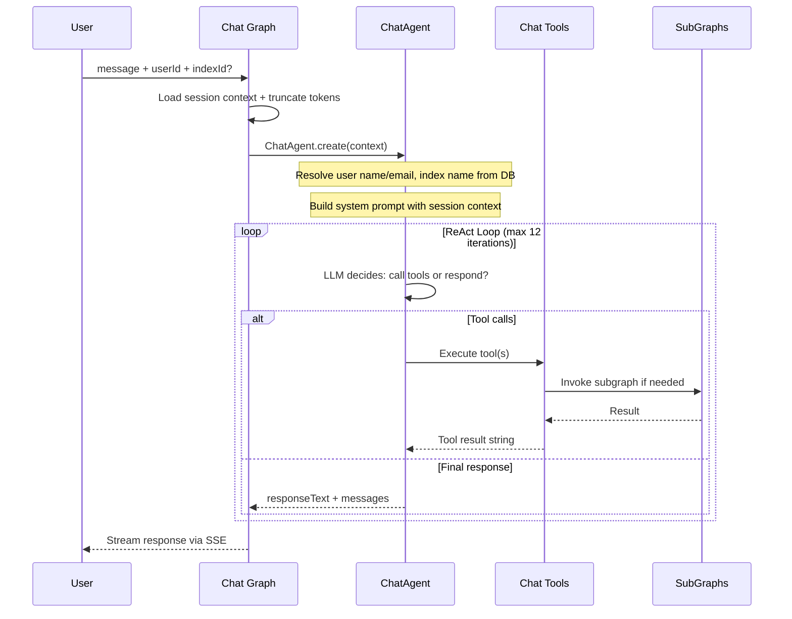
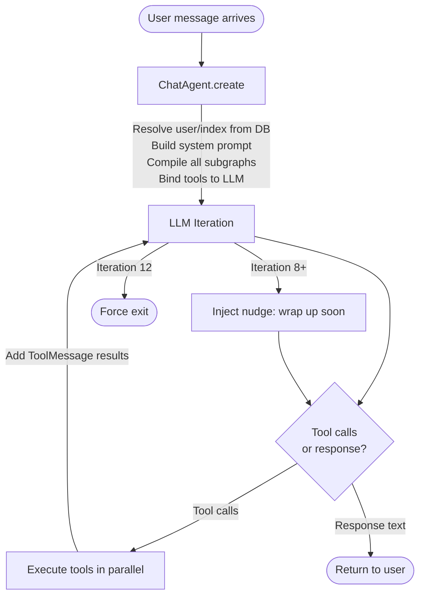
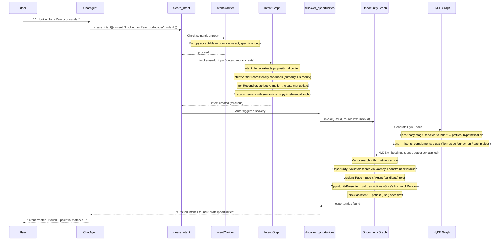
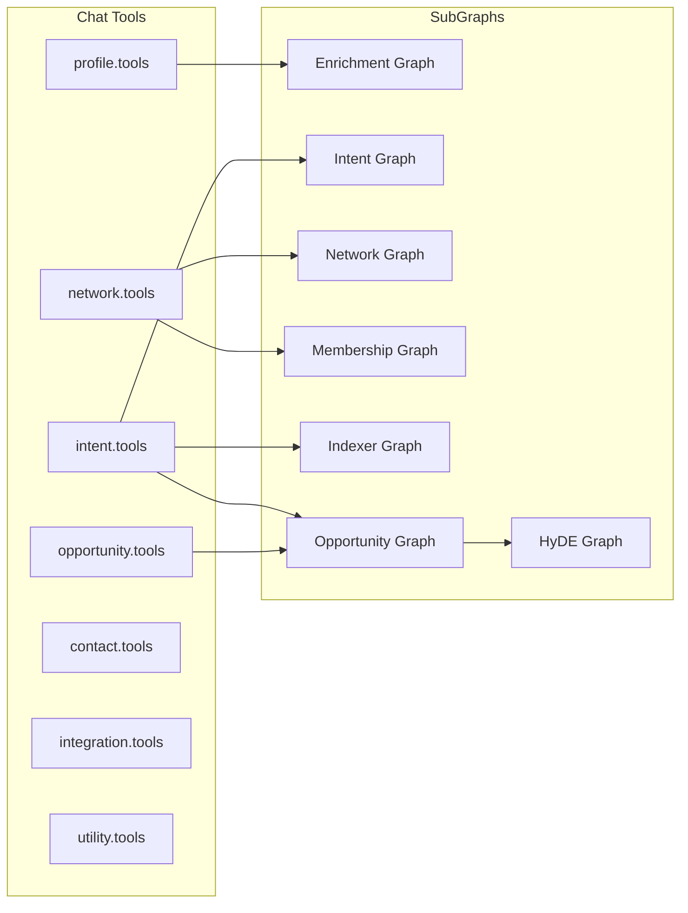

# Index Network Protocol

This is the protocol layer: LangGraph workflows, AI agents, chat tools, and supporting infrastructure that power intent-driven discovery.

## Directory Structure

```
packages/protocol/src/
  agent/            Agent-registry tools (register/list/update/delete, grant/revoke permission)
  chat/             Chat graph, agent, prompt modules, streaming, suggestions, title, summarizer, interrupt classifier
  contact/          Contact invites and contact tools
  context/          User Context generator (premise → network-scoped context paragraphs)
  integration/      Integration sync tools
  intent/           Intent graph, inferrer, verifier, reconciler, clarifier, specificity, indexer
  maintenance/      Maintenance graph (feed health, opportunity expiration)
  mcp/              MCP server + elicitation builder/dispatcher
  negotiation/      Negotiation graph, agent (IndexNegotiator), insight + summarizer, tools
  network/          Network (index) graph, membership graph, intent-network (indexer) graph, recommender, tools
  opportunity/      Opportunity graph, evaluator, presenter, enricher, discover, evidence, introducer, delivery card, utils
    feed/           Home feed graph, feed categorizer, feed health
  premise/          Premise graph, decomposer, analyzer, indexer, tools
  profile/          Profile graph, generator, enricher, tools
  questioner/       Questioner agent (mode-driven decision-question generation), presets, tools
  shared/
    agent/          Model config/signal, response streamer, tool factory/helpers/registry/runtime
    assignment/     Network-assignment policy (threshold scoring, scope resolution)
    hyde/           HyDE graph, generator, strategies, lens inferrer
    interfaces/     Adapter contracts (database, embedder, cache, queue, scraper, agent, runs, etc.)
    network/        Network metadata renderer
    observability/  Logger, request context, performance, trace, debug-meta sanitizer
    schemas/        Shared Zod schemas (question, profile, negotiation, network-assignment, etc.)
    ui/             Lucide icon catalog
    utils/          Telegram-handle and social-label helpers
  docs/             Design papers (linguistic and semantic governance theory)
```

## Graphs

| Graph | File | Purpose |
|-------|------|---------|
| Chat | `chat/chat.graph.ts` | ReAct agent loop — LLM calls tools, responds to user |
| Intent | `intent/intent.graph.ts` | Clarify, infer, verify felicity conditions, reconcile, and persist intents |
| Enrichment | `enrichment/enrichment.graph.ts` | Generate/update user identity with scraping and embedding (decomposes into premises) |
| Premise | `premise/premise.graph.ts` | Decompose self-descriptive input into atomic premises, classify/score felicity, index + assign to networks |
| Opportunity | `opportunity/opportunity.graph.ts` | HyDE-based discovery: search, evaluate (valency), rank, persist |
| HyDE | `shared/hyde/hyde.graph.ts` | Infer search lenses, generate hypothetical documents per lens/corpus, and embed them (cache-aware) |
| Network | `network/network.graph.ts` | Manage network CRUD |
| Network Membership | `network/membership/membership.graph.ts` | Manage network member join/leave |
| Intent Indexer | `network/indexer/indexer.graph.ts` | Evaluate and assign/unassign intents to indexes |
| Feed | `opportunity/feed/feed.graph.ts` | Categorize and curate home feed content |
| Maintenance | `maintenance/maintenance.graph.ts` | Periodic maintenance tasks (feed health, opportunity expiration) |
| Negotiation | `negotiation/negotiation.graph.ts` | Multi-turn bilateral negotiation flows |

## Agents

| Agent | File | Used By |
|-------|------|---------|
| ChatAgent | `chat/chat.agent.ts` | Chat graph — orchestrates ReAct loop and tool calls |
| Chat Prompt | `chat/chat.prompt.ts` | Chat graph — system prompt and context builder |
| Chat Prompt Modules | `chat/chat.prompt.modules.ts` | Chat graph — composable prompt modules |
| Title Generator | `chat/chat.title.generator.ts` | Chat service — generates conversation titles |
| Chat Suggester | `chat/chat.suggester.ts` | Chat — generates proactive reply suggestions |
| Chat Summarizer | `chat/chat.summarizer.ts` | Chat — produces a read-through digest of a chat session |
| Chat Interrupt Classifier | `chat/chat.interrupt.classifier.ts` | Chat — classifies whether a new message interrupts an in-flight turn |
| Intent Clarifier | `intent/intent.clarifier.ts` | Intent tools — checks specificity (entropy threshold) before persisting |
| Intent Inferrer | `intent/intent.inferrer.ts` | Intent graph — extracts structured intents from free text |
| Intent Reconciler | `intent/intent.reconciler.ts` | Intent graph — determines create/update/expire action (Donnellan's distinction) |
| Intent Verifier | `intent/intent.verifier.ts` | Intent graph — classifies speech act type; scores felicity conditions and semantic entropy |
| Intent Indexer | `intent/intent.indexer.ts` | Intent Network graph — scores intent-network fit as relevancy score |
| Enrichment Generator | `enrichment/enrichment.generator.ts` | Enrichment graph — generates structured identity from raw data |
| Enrichment Enricher | `enrichment/enrichment.enricher.ts` | Identity enrichment — display name and metadata enrichment |
| Premise Decomposer | `premise/premise.decomposer.ts` | Premise graph — decomposes free text into atomic, first-person self-descriptive premises |
| Premise Analyzer | `premise/premise.analyzer.ts` | Premise graph — classifies the premise speech act (declarative/assertive) and scores felicity |
| Premise Indexer | `premise/premise.indexer.ts` | Premise graph — embeds premises and scores network fit for assignment |
| User Context Generator | `context/context.generator.ts` | Enrichment / UserContextQueue — synthesizes network-scoped context paragraphs from a user's premises |
| Questioner Agent | `questioner/questioner.agent.ts` | Questioner queue — mode-driven structured decision-question generation (profile/intent/negotiation/discovery) |
| Network Recommender | `network/network.recommender.ts` | Network flows — recommends networks for a user/intent |
| HyDE Generator | `shared/hyde/hyde.generator.ts` | HyDE graph — generates a hypothetical match document per lens, in the target corpus voice |
| HyDE Strategies | `shared/hyde/hyde.strategies.ts` | HyDE graph — lens type re-exports and per-corpus prompt templates |
| Lens Inferrer | `shared/hyde/lens.inferrer.ts` | HyDE graph — infers 1–N free-text search lenses, each tagged with a target corpus (profiles / intents / premises) |
| Opportunity Evaluator | `opportunity/opportunity.evaluator.ts` | Opportunity graph — scores matches; assigns valency role (Agent/Patient/Peer) |
| Opportunity Presenter | `opportunity/opportunity.presenter.ts` | Home graph, opportunity tools — generates role-appropriate descriptions (Grice's Maxim of Relation) |
| Feed Categorizer | `opportunity/feed/feed.categorizer.ts` | Feed graph — classifies and curates feed items |
| Opportunity Introducer | `opportunity/opportunity.introducer.ts` | Introducer-driven contact-pair discovery |
| Questioner Agent | `questioner/questioner.agent.ts` | Mode-driven decision-question generation (discovery, intent, enrichment, negotiation, chat) |
| Contact Inviter | `contact/contact.inviter.ts` | Invite flow — generates personalized invite messages |
| Index Negotiator | `negotiation/negotiation.agent.ts` | Negotiation graph — system AI that drafts/evaluates a turn when no personal agent responds |
| Negotiation Insights Generator | `negotiation/insight.generator.ts` | Negotiation graph — synthesizes negotiation session insights |
| Negotiation Summarizer | `negotiation/negotiation.summarizer.ts` | Negotiation — builds the discovery negotiation digest (deterministic fallback when LLM unavailable) |

## Tools (Chat)

Tools are registered in `shared/agent/tool.registry.ts` and assembled per session by `shared/agent/tool.factory.ts`.

| File | Tools |
|------|-------|
| `enrichment/enrichment.tools.ts` | `read_user_contexts`, `preview_user_context`, `confirm_user_context`, `create_user_context`, `update_user_context`, `record_onboarding_privacy_consent`, `complete_onboarding`, `get_enrichment_run`, `cancel_enrichment_run` |
| `premise/premise.tools.ts` | `create_premise`, `read_premises`, `update_premise`, `retract_premise` |
| `intent/intent.tools.ts` | `read_intents`, `create_intent`, `update_intent`, `delete_intent`, `search_intents`, `create_intent_index`, `read_intent_indexes`, `delete_intent_index` |
| `network/network.tools.ts` | `read_networks`, `create_network`, `update_network`, `delete_network`, `read_network_memberships`, `create_network_membership`, `delete_network_membership` |
| `opportunity/opportunity.tools.ts` | `discover_opportunities`, `get_discovery_run`, `cancel_discovery_run`, `list_opportunities`, `update_opportunity`, `confirm_opportunity_delivery`¹ |
| `contact/contact.tools.ts` | `import_contacts`, `list_contacts`, `add_contact`, `remove_contact`, `search_contacts` |
| `integration/integration.tools.ts` | `import_gmail_contacts` |
| `agent/agent.tools.ts` | `register_agent`, `list_agents`, `update_agent`, `delete_agent`, `grant_agent_permission`, `revoke_agent_permission` |
| `negotiation/negotiation.tools.ts`² | `list_negotiations`, `get_negotiation`, `respond_to_negotiation` |
| `questioner/questioner.tools.ts` | `read_pending_questions` |
| `shared/agent/utility.tools.ts` | `scrape_url`, `read_docs` |

¹ `confirm_opportunity_delivery` is an OpenClaw delivery-ledger write — it is filtered out of regular chat sessions and only reachable over MCP.
² Negotiation tools are only registered when an `agentDispatcher` is provided.

## Core Concepts

The system models human collaboration through a linguistic and information-theoretic framework. Terminology follows Speech Act Theory (Searle), Hypothetical Document Embeddings (Gao et al.), Valency theory (Hanks), and Gricean pragmatics.

| Concept | Description |
|---------|-------------|
| **User** | Identity (session auth). Has one profile and many intents. Member of indexes. |
| **Profile** | User's identity, narrative, skills, interests. Provides the **constitutive context** — what the user *is* and therefore has the *authority* to do. Has vector embedding and HyDE embeddings for semantic matching. Decomposed into premises during enrichment. |
| **Premise** | A **declarative or assertive speech act** about the self — an atomic, first-person proposition a user asserts about who they are ("I am a climate-tech founder", "I hold a PhD in computational biology"). Premises are *conditions of possibility*: facts that ground discovery, as opposed to intents, which are desires/requests. They are decomposed from profile/free-text input, classified and felicity-scored by the Premise Analyzer, embedded, and assigned to networks. The premise graph (`premise/premise.graph.ts`) owns their create/update/query lifecycle, and premise changes cascade into profile and user-context regeneration. |
| **User Context** | A network-scoped synthetic paragraph synthesized from a user's premises by the `UserContextGenerator`, stored with its embedding. The opportunity graph uses contexts for **context-to-intent discovery** — it loads a user's contexts and searches for matching intents, running alongside premise-to-premise discovery as a complementary strategy. Regenerated whenever the user's premises change. |
| **Intent** | A **commissive** or **directive speech act** — what the user is seeking or offering. Modelled as a Specific Indefinite: a future state uniquely satisfiable by a matching candidate. Each intent carries a **semantic entropy** score (constraint density), a **referential anchor** (Donnellan referential/attributive mode), and **felicity condition** scores (preparatory/authority and sincerity). |
| **Index** | A community scoped to a purpose. Has members with roles, an optional prompt for LLM-based evaluation, and a join policy. Discovery is network-scoped — opportunities only arise between intents that share an index. |
| **Opportunity** | A **semantic intersection**: the point where a candidate's constitutive facts (profile/intent) satisfy the propositional content of a source intent. Scored by the Opportunity Evaluator using **valency** (argument-role fit) and **constraint satisfaction**. Presented with dual descriptions per **Grice's Maxim of Relation** — one framed for the source, one for the candidate. |
| **HyDE** | Hypothetical Document Embeddings. Lens-based: the `LensInferrer` derives 1–N free-text **lenses** (search perspectives, e.g. "SF-based early-stage investor"), each tagged with a target corpus. Per-corpus generation preserves the original strategy semantics: **profiles** hallucinates the ideal candidate's biography (direct satisfaction of the intent's conditions — the former *Mirror* strategy), **intents** hallucinates a complementary goal via meaning postulates ("if A wants to buy, infer B wants to sell" — the former *Reciprocal* strategy), and **premises** hallucinates an identity/values self-description. (The former *Neighborhood* discourse-frame strategy was retired with the move to lenses.) The encoder acts as a dense bottleneck filtering hallucinated specifics and retaining the semantic signal. |
| **Felicity Conditions** | Scores evaluating whether an intent is valid: **preparatory condition** (does the user have the authority/skills for this act?) and **sincerity condition** (is the commitment genuine?). Intents that fail these are classified as *misfired* or *void*. |
| **Semantic Entropy** | Constraint density of an intent (0.0 = maximally constrained, 1.0 = trivially satisfiable). High-entropy intents ("I want a job") trigger an **elaboration loop** — a request for missing constraints before persistence. |
| **Semantic Governance** | The full pipeline that ensures only actionable, felicitous, sufficiently clear intents enter the graph. Referential breadth is retained as warning metadata for user-confirmed proposal approvals and explicit updates rather than acting as a universal write prohibition. Implemented by the Intent Verifier and Intent Clarifier agents. |
| **Valency Roles** | Derived from the argument structure of the source intent's goal verb (Hanks). The Opportunity Evaluator assigns: **Agent** (the one who can offer/do), **Patient** (the one who needs/seeks), or **Peer** (symmetric collaboration). These roles govern opportunity visibility and the notification cascade. |

## Opportunity Lifecycle and Role-Based Visibility

Opportunities flow through a tiered reveal cascade determined by actor role, not by who triggered discovery.

### Status Tiers

- **Tier 0** (`latent`): Draft — first tier can send
- **Tier 1** (`pending`): Sent — next tier is notified and can act
- **Tier 2** (`accepted` / `rejected` / `expired`): Terminal — all actors can see

### Role–Visibility Matrix

| Role | No introducer | With introducer |
|------|--------------|-----------------|
| `introducer` | n/a | Tier 0 (always) |
| `patient` | Tier 0 (always) | Tier 1 (pending+) |
| `agent` | Tier 1 (pending+) | Tier 2 (accepted+) |
| `peer` | Tier 0 (always) | Tier 0 (always) |
| `party` | same as patient | same as patient |

### Status Transitions

| Transition | Who triggers |
|-----------|-------------|
| `latent → pending` | Introducer, patient (no introducer), peer, party (no introducer) |
| `pending → accepted` | Recipient accepts |
| `pending → rejected` | Recipient declines |
| `latent/pending → expired` | TTL or user dismisses |

## How a User Message Flows Through the System

When a user sends a message, everything starts at the Chat Graph. The agent decides which tools to call, and those tools invoke subgraphs.

### High-Level Flow



### What Happens Inside the Agent Loop

The ChatAgent is a ReAct-style loop. Each iteration, the LLM sees the full conversation (system prompt + messages + tool results) and either makes tool calls or produces a final response.



### Example: "Create a profile for me"

```mermaid
sequenceDiagram
    participant User
    participant Agent as ChatAgent
    participant PT as create_user_context
    participant PG as Enrichment Graph

    User->>Agent: "Create a profile for me"
    Agent->>PT: create_user_context({})
    PT->>PT: Check user fields (name, email, URLs)
    alt Missing name/email
        PT-->>Agent: "Need name and LinkedIn URL"
        Agent-->>User: "What's your full name and LinkedIn?"
        User->>Agent: "John Doe, linkedin.com/in/johndoe"
        Agent->>PT: create_user_context({name, linkedinUrl})
    end
    PT->>PG: invoke(userId, mode: write, forceUpdate: true)
    Note over PG: scrape web for identity (constitutive context)
    Note over PG: EnrichmentGenerator builds structured identity
    Note over PG: embed profile (pgvector)
    Note over PG: LensInferrer infers search lenses; HyDE Generator creates per-lens docs
    Note over PG: embed HyDE docs
    PG-->>PT: profile created
    PT-->>Agent: "Profile created successfully"
    Agent-->>User: "Your profile has been created with..."
```

### Example: "I'm looking for a React co-founder"



### Tool-to-Subgraph Mapping



## Business Logic Flows

### Intent Lifecycle

Handled by the **Intent Graph**:
1. **Clarification** (pre-graph): `IntentClarifier` checks semantic entropy — if the utterance is underspecified (high entropy, trivially satisfiable), it returns an elaboration request rather than persisting.
2. **Inference**: `IntentInferrer` extracts structured intents (propositional content) from free text. Can produce multiple intents from a single input.
3. **Semantic Verification**: `IntentVerifier` classifies the speech act type (commissive, directive, assertive) and scores felicity conditions — preparatory (authority) and sincerity. Assigns `felicitous`, `misfired`, or `void` status.
4. **Reconciliation**: For creation, `IntentReconciler` applies Donnellan's distinction — referential intents (user has a specific target in mind) update an existing record; attributive intents (any member of a class) create a new one if sufficiently different. Explicit updates bypass that create-versus-update choice and bind the single verified candidate to the supplied active owned intent ID.
5. **Persistence**: Executor writes the intent with `semanticEntropy`, `referentialAnchor`, `speechActType`, and `felicityScores` fields.

### Premise & Context Lifecycle

Handled by the **Premise Graph**, **Enrichment Graph**, and **User Context Generator**:
1. **Decomposition**: `PremiseDecomposer` splits profile data or free text into atomic, first-person, non-redundant premises.
2. **Analysis**: `PremiseAnalyzer` classifies each premise's speech act (declarative vs. assertive) and scores its felicity conditions — premises are the *constitutive* facts that establish what a user has the authority to do.
3. **Indexing & assignment**: `PremiseIndexer` embeds each premise and scores network fit; the shared network-assignment policy (`shared/assignment/network-assignment.policy.ts`) decides which networks the premise is assigned to.
4. **Context synthesis**: premise changes cascade into the `UserContextGenerator`, which regenerates the user's network-scoped context paragraph (plus embedding and HyDE docs). Cold-start mode synthesizes from all premises; incremental mode applies a single add/update/retract/expire to the existing context.
5. **Discovery feed**: stored context embeddings power **context-to-intent discovery** in the opportunity graph, complementing premise-to-premise matching.

### HyDE Pipeline

Handled by the **HyDE Graph** and **Enrichment Graph**. The pipeline is **lens-based**: instead of hardcoded strategy names, the `LensInferrer` derives 1–N free-text lenses from the source text (and optional profile context), each tagged with a target corpus that selects the generation template:
- **profiles corpus**: Generates a hypothetical biography of the ideal candidate whose constitutive facts satisfy the intent's conditions of satisfaction (direct valency slot fill — the former *Mirror* strategy).
- **intents corpus**: Generates a complementary goal statement via meaning postulates — "If user A wants to invest, infer B wants funding" (the former *Reciprocal* strategy).
- **premises corpus**: Generates an identity/values self-description for someone whose worldview aligns with the source text.
- The former *Neighborhood* (discourse-frame) strategy was retired with the move to lenses; lens labels carry the contextual specificity instead (including location awareness).
- The encoder acts as a **dense bottleneck** — hallucinated specifics (fake names, invented details) are filtered out; only the semantic relevance signal is preserved in the embedding.

### Opportunity Discovery

Handled by the **Opportunity Graph**:
1. **Prep**: Load user's indexed intents and HyDE documents.
2. **Scope**: Determine target indexes (single or all).
3. **Discovery**: Vector similarity search within network scope. Two complementary strategies run and merge: **premise-to-premise** matching (the user's premise embeddings are searched against candidate premises) and **context-to-intent** matching (a user's network-scoped context embeddings are searched against candidate intents). (Profile-HyDE discovery was retired in WS10.)
4. **Evaluation**: `OpportunityEvaluator` scores each candidate pair via **valency** (does the candidate fill the argument slot of the source's goal verb?) and **constraint satisfaction** (does the candidate's constitutive context match all extracted constraints?). Assigns role: Agent, Patient, or Peer.
5. **Presentation**: `OpportunityPresenter` generates two descriptions per Grice's Maxim of Relation — one from the source's frame, one from the candidate's frame.
6. **Persist**: Opportunities created as `latent` with actor roles. Role determines tier-0 visibility (see Opportunity Lifecycle above).

### Chat as Orchestration

The **Chat Graph** is a ReAct loop: one `agent_loop` node where the LLM decides to call tools or respond. All protocol operations are accessible through tools. Destructive actions (update/delete) go through the intent/opportunity graph's reconciler rather than direct mutation, preserving semantic governance invariants.

## Key Invariants

- **Network-scoped discovery**: Opportunities only arise between intents sharing an index
- **Specific Indefinites only**: Underspecified (high-entropy) intents do not enter the graph — they trigger elaboration
- **Felicity-gated persistence**: Only intents classified as `felicitous` are persisted as active
- **Dual synthesis**: Each opportunity has descriptions framed for both actors (Grice's Maxim of Relation)
- **Role-based visibility**: Opportunity reveal follows a tiered cascade; agent visibility is deferred when a patient or introducer is present
- **Encoding bottleneck**: HyDE hallucinations are never stored or shown — only their embeddings are used

## Shared Infrastructure

| File | Purpose |
|------|---------|
| `shared/observability/protocol.logger.ts` | Protocol-layer logging with call-scoped tracing |
| `shared/agent/model.config.ts` | Centralized model and OpenRouter configuration |
| `shared/agent/model-signal.ts` | Abort-signal-aware model invocation helper |
| `shared/agent/tool.runtime.ts` | Per-tool timeout/output-budget runtime and stable error envelopes |
| `shared/agent/response.streamer.ts` | SSE streaming for chat responses |
| `shared/assignment/network-assignment.policy.ts` | Threshold-based network-assignment scoring and scope resolution |
| `shared/network/metadata.renderer.ts` | Renders network metadata into prompt context |
| `chat/chat.utils.ts` | Token counting and context window management |
| `opportunity/opportunity.discover.ts` | Ad-hoc discovery from chat queries |
| `opportunity/opportunity.presentation.ts` | Pure card text generation for opportunity display |
| `opportunity/opportunity.enricher.ts` | Enrich opportunity records with profile data |
| `opportunity/opportunity.utils.ts` | Lens-corpus → actor-role derivation, opportunity visibility, feed composition helpers |
| `opportunity/opportunity.introducer.ts` | Introducer-driven contact-pair discovery |
| `opportunity/opportunity.evidence.ts` | Builds and merges per-candidate opportunity evidence |
| `opportunity/delivery-card.cache.ts` | Cached delivery-card batch builder for opportunity delivery |
| `opportunity/feed/feed.health.ts` | Feed health metrics computation |
| `opportunity/opportunity.labels.ts` | Opportunity status and role label constants |

## Data Model

This package is adapter-free and owns **no** schema — it accesses data only through the
interfaces in `shared/interfaces/`. The canonical Drizzle schema lives in the backend at
`services/api/src/schemas/database.schema.ts`.

Core tables the protocol interfaces read/write:

- **Identity & profile**: `users` (name/bio/location), `user_socials`, `premises`, `premise_networks`, `user_contexts`
- **Intents & networks**: `intents`, `networks`, `network_members`, `intent_networks`, `personal_networks`
- **Opportunities & discovery**: `opportunities`, `hyde_documents`, `opportunity_discovery_runs`, `enrichment_tool_runs`, `questions`
- **Agents**: `agents`, `agent_transports`, `agent_permissions`, `apikey`

> Terminology note: "index" and "network" refer to the same concept. The product
> surface says *index*; the current schema and most tool names use **network**
> (`networks`, `network_members`, `intent_networks`).
